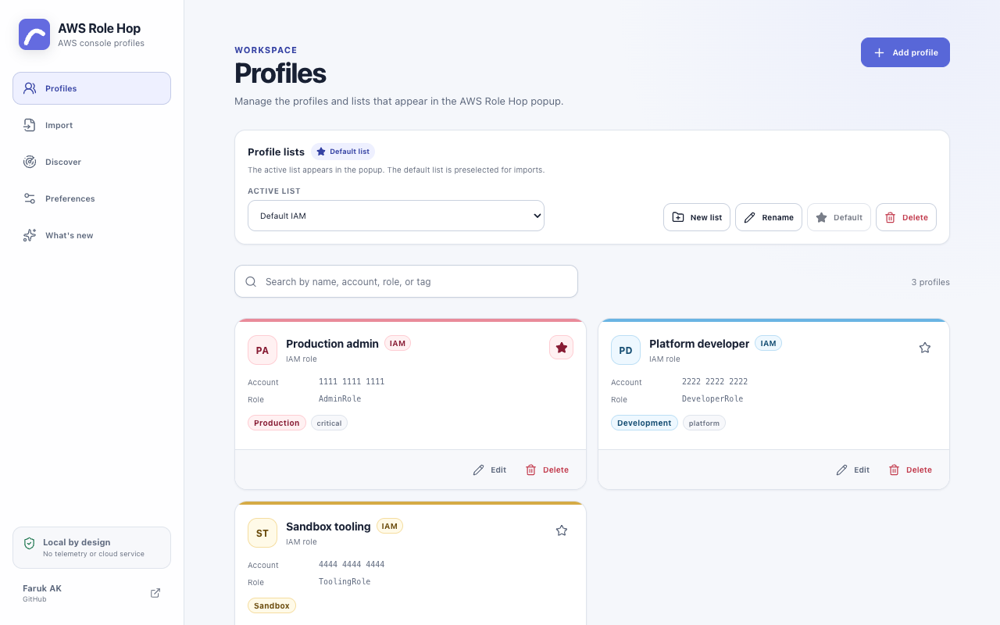
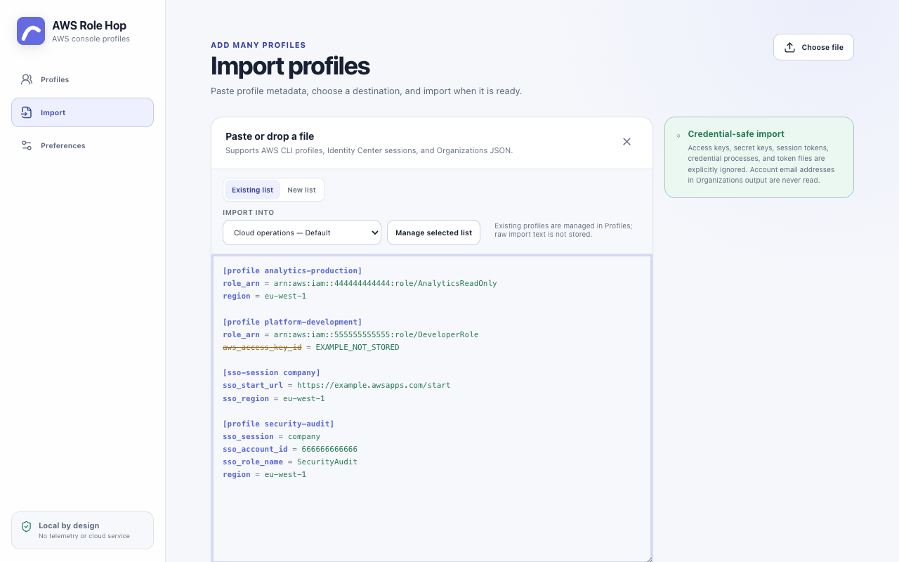
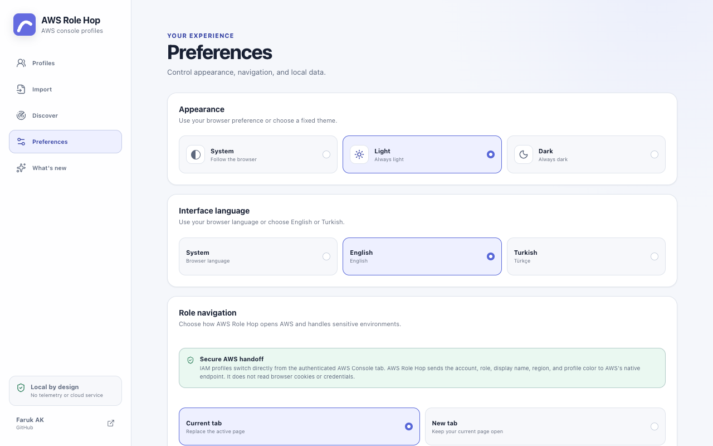
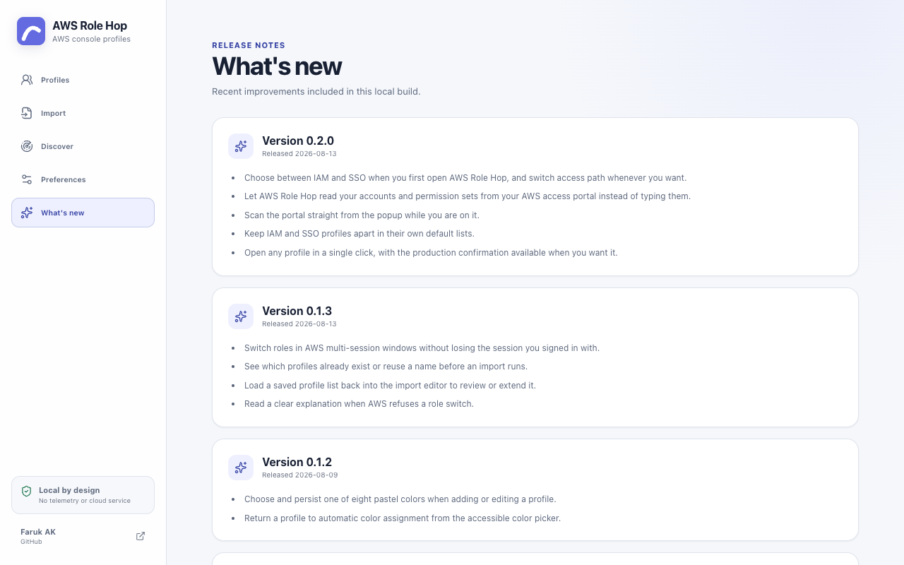

# AWS Role Hop

AWS Role Hop is a fast, private profile launcher for the AWS Management Console. It keeps IAM roles and IAM Identity Center permission sets searchable without storing credentials or reading AWS Console pages.

> AWS Role Hop is under active development and has not been published to browser stores yet.

[](https://github.com/farukak/aws-role-hop/actions/workflows/ci.yml)
[](LICENSE)




## Highlights

- Separate IAM and IAM Identity Center modes, chosen on first open and switchable at any time
- IAM role profiles for the standard AWS, AWS GovCloud (US), and AWS China partitions
- AWS IAM Identity Center shortcuts with optional landing regions
- Discovery of Identity Center accounts and permission sets from your AWS access portal, behind a permission the browser only asks for when you use it
- Unlimited named profile lists with explicit active and default-list behavior
- Automatic or manually selected low-saturation pastel colors, with distinct production and staging treatments
- Favorites, recent profiles, tags, account masking, and keyboard-first search
- One click to open any profile, with an optional confirmation for production
- Strict AWS config and Organizations JSON import with live validation and syntax highlighting
- Local JSON backup and restore
- Full-tab settings with light, dark, and system themes
- Manifest V3 builds for Chrome, Edge, Firefox, and Safari

## Screenshots

| Profiles                                                                                    | Import                                                                                    |
| ------------------------------------------------------------------------------------------- | ----------------------------------------------------------------------------------------- |
| [](docs/assets/01-profiles.png) | [](docs/assets/02-import.png) |

| Preferences                                                                                                   | What's new                                                                                   |
| ------------------------------------------------------------------------------------------------------------- | -------------------------------------------------------------------------------------------- |
| [](docs/assets/03-preferences.png) | [](docs/assets/04-whats-new.png) |

All screenshots use fictional AWS account data.

## Privacy and security

AWS Role Hop requests `storage`, `activeTab`, and narrowly scoped access to supported AWS Console pages. It does not request browser history, broad `tabs`, cookie, identity, or credential permissions, and it does not run on other websites.

- Profiles, profile lists, and preferences stay in the browser's local extension storage.
- AWS access keys, secret keys, session tokens, credential processes, and token files are excluded from imports.
- There is no analytics, telemetry, account system, backend, or remotely hosted code.
- Identity Center navigation uses [AWS IAM Identity Center shortcut links](https://docs.aws.amazon.com/singlesignon/latest/userguide/createshortcutlink.html).
- IAM role launches start from the authenticated AWS Console tab. A content script limited to supported Console origins passes the selected account, role, display name, landing region, and AWS Role Hop color to a bundled page-context bridge. The bridge reads AWS's own sign-in endpoint, multi-session metadata, and ephemeral CSRF value, then submits AWS's native switch-role POST directly. No intermediate Switch Role page is opened. AWS controls authentication, authorization, role-history persistence, and the final redirect.
- AWS Role Hop does not read browser cookies or credentials. The CSRF value and Console metadata are used only in memory for the requested switch and are not stored, logged, or sent anywhere except AWS's validated sign-in endpoint.
- Production profiles require a separate AWS Role Hop confirmation by default.

See [PRIVACY.md](PRIVACY.md) for the complete data-handling policy and [SECURITY.md](SECURITY.md) for vulnerability reporting.

## Profile lists

The active list is the list shown in the popup, and new profiles created manually are added to it. The default list is preselected on the import screen. After a successful import, AWS Role Hop makes the destination list active and returns to Profiles so the imported entries are immediately visible. Raw import text is not retained; **Manage selected list** opens the normalized profiles that can be viewed, edited, or deleted safely.

## Browser support

| Browser        | Build target       | Distribution             |
| -------------- | ------------------ | ------------------------ |
| Chrome         | Chromium MV3       | Chrome Web Store         |
| Brave          | Chrome MV3 package | Chrome Web Store package |
| Microsoft Edge | Edge MV3           | Microsoft Edge Add-ons   |
| Firefox        | Firefox MV3        | Firefox Add-ons          |
| Safari         | Safari MV3         | Apple App Store          |

AWS Role Hop supports current stable browser releases. Store signing, listing assets, and final browser-specific acceptance testing are release steps and are intentionally not committed as generated artifacts.

Safari uses the same WebExtension source, followed by [Apple's Safari extension packaging flow](https://developer.apple.com/safari/extensions/). Browser-specific manifests are generated by [WXT](https://wxt.dev/guide/essentials/target-different-browsers).

### Install an unpacked development build

No signed store build is available yet. To evaluate AWS Role Hop locally:

1. Install Node.js 24 and run `npm ci`.
2. Run `npm run build:chrome`.
3. Open `chrome://extensions`, enable **Developer mode**, select **Load unpacked**, and choose `.output/chrome-mv3`.

Unpacked builds are unsigned and do not auto-update. Firefox can load `.output/firefox-mv3/manifest.json` temporarily from `about:debugging`; Safari requires Apple's conversion, signing, and packaging flow. Use signed browser-store builds when they become available.

## Releases and updates

Tagged source releases and verified browser packages are published on [GitHub Releases](https://github.com/farukak/aws-role-hop/releases). Release packages include SHA-256 checksums. Installed store versions are updated by the browser store, not by GitHub. After a genuine version upgrade, AWS Role Hop opens bundled, local-only release notes once; it does not contact GitHub in the background.

## Development

### Requirements

- Node.js 24
- npm 10 or later

Install the exact dependency graph:

```sh
npm ci
```

Start a Chromium development build:

```sh
npm run dev
```

Start a Firefox development build:

```sh
npm run dev:firefox
```

Generated development and release files are written to `.output/` and are not committed.

### Quality checks

```sh
npm run check
```

This runs formatting verification, ESLint, strict TypeScript checking, the unit/component suite with enforced coverage thresholds, all browser builds, and loaded-extension Playwright E2E tests. It is the core gate CI enforces before package linting and dependency auditing.

Individual steps:

```sh
npm run lint          # ESLint, zero warnings tolerated
npm run typecheck     # tsc --noEmit
npm test              # Vitest, single run
npm run test:watch    # Vitest, watch mode
npm run test:coverage # Vitest with a V8 coverage report
npm run lint:firefox  # build the Firefox target and validate it with web-ext
```

Tests live next to the code they cover as `*.test.ts` and focus on the layers
where correctness matters most: profile validation, the deterministic color
system, AWS sign-in URL construction, AWS config import, and the storage layer.
Extension APIs are provided by WXT's fake browser, so tests need no real browser.

### Release builds

```sh
npm run build:all
```

Individual targets are available as `build:chrome`, `build:edge`, `build:firefox`, and `build:safari`. Chrome, Edge, and Firefox ZIP packages can be created with the corresponding `zip:*` scripts.

## Import format

AWS Role Hop accepts AWS CLI-style profile sections and Identity Center sessions. Credential fields are ignored and never become part of the profile model.

```ini
[profile development]
role_arn = arn:aws:iam::123456789012:role/Developer

[sso-session company]
sso_start_url = https://example.awsapps.com/start
sso_region = eu-west-1

[profile platform]
sso_session = company
sso_account_id = 123456789012
sso_role_name = PlatformAccess
region = eu-west-1
```

AWS still authorizes every role or permission-set transition. AWS Role Hop does not grant access and cannot bypass AWS permissions. See the [AWS role switching documentation](https://docs.aws.amazon.com/IAM/latest/UserGuide/id_roles_use_switch-role-console.html) for platform constraints.

## Creator

Created and maintained by [Faruk AK](https://github.com/farukak).

## Contributing

Read [CONTRIBUTING.md](CONTRIBUTING.md) before opening a pull request, and follow the [Code of Conduct](CODE_OF_CONDUCT.md). Security reports must follow [SECURITY.md](SECURITY.md) and must not be submitted as public issues.

Released changes are recorded in [CHANGELOG.md](CHANGELOG.md).

## License

Licensed under the [Apache License 2.0](LICENSE).

AWS Role Hop is an independent open-source project and is not affiliated with, endorsed by, or sponsored by Amazon Web Services. AWS and related marks are trademarks of Amazon.com, Inc. or its affiliates.
